# EmployeeForm
A web form to manage employees’ basic information and their skills using .NET MVC &amp; Entity Framework with applying different Design Patterns.

# Used Design Patterns and Principles
* Repository Pattern.
* Service Pattern.
* Unit of Work Pattern.
* Factory Pattern.
* Inversion of control and Dependency injection.
* MVC.

# Used libraries and tools
* Chosen plugin: to creat Multi-Select Drop Down List.
* Autofac.

# Class Diagrams
* Class Diagram for Model project:

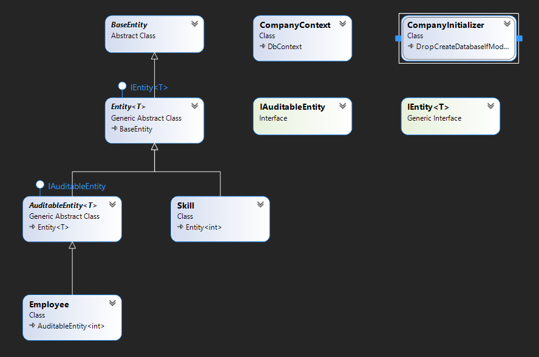

* Class Diagram for Repository project:

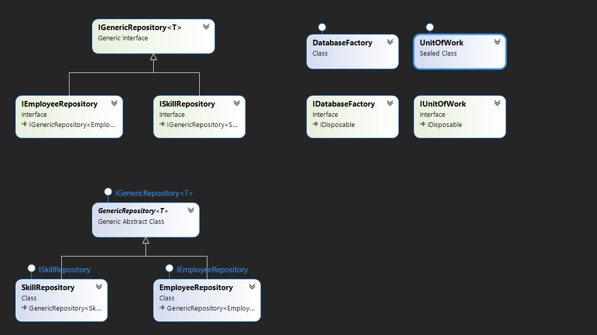

* Class Diagram for Service project:

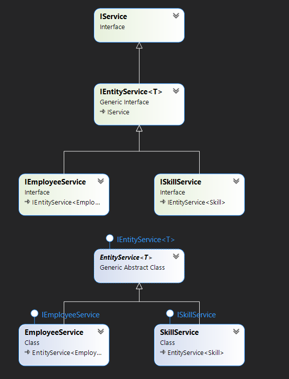

# ScreenShots of the System
* The First Page will contain a table of save employees. 
* For each employee, you can edit/delete/view details of this employee.

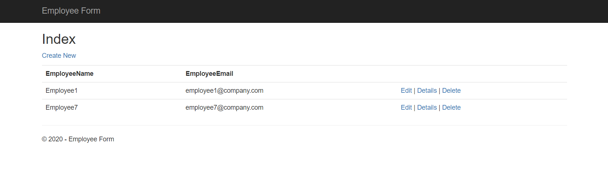

* To create new employee, you can enter 'create new' or 'Employee Form' in the header.

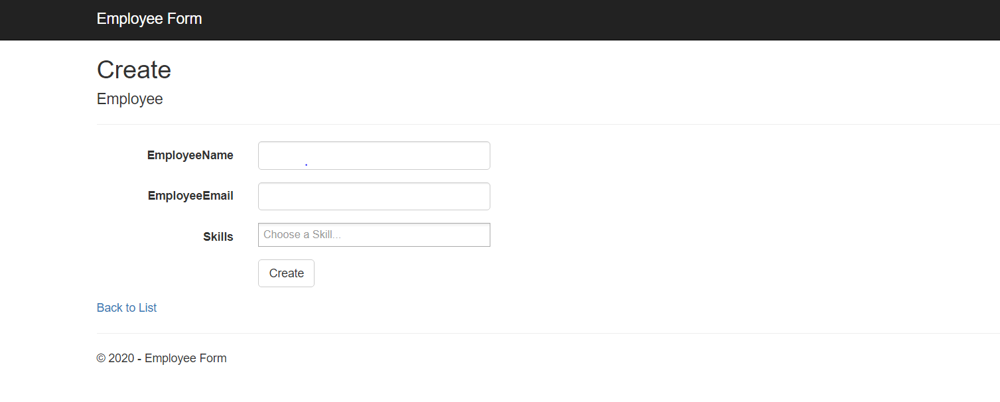

* Employee Name is required but Employee Email and Skills are optional.

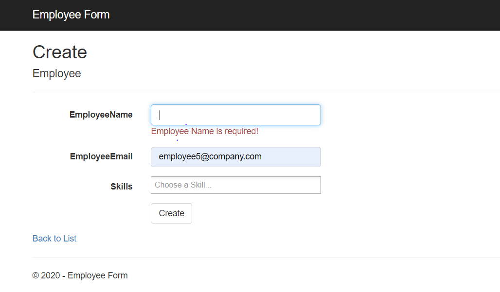

* For Skills field, it is autocomplete, and you can easily select or remove any of them.

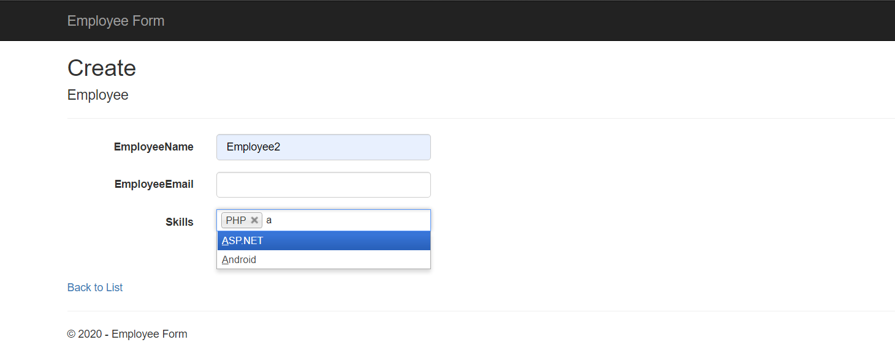

* After creating new Employee, it will be automatically added to the employee List.

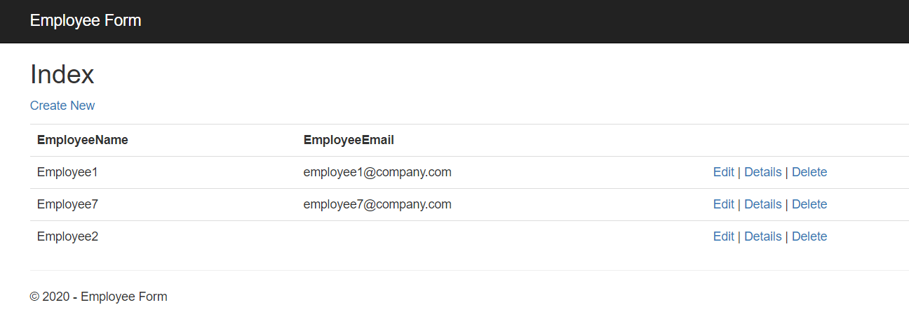

* When choosing Details option for employee2.

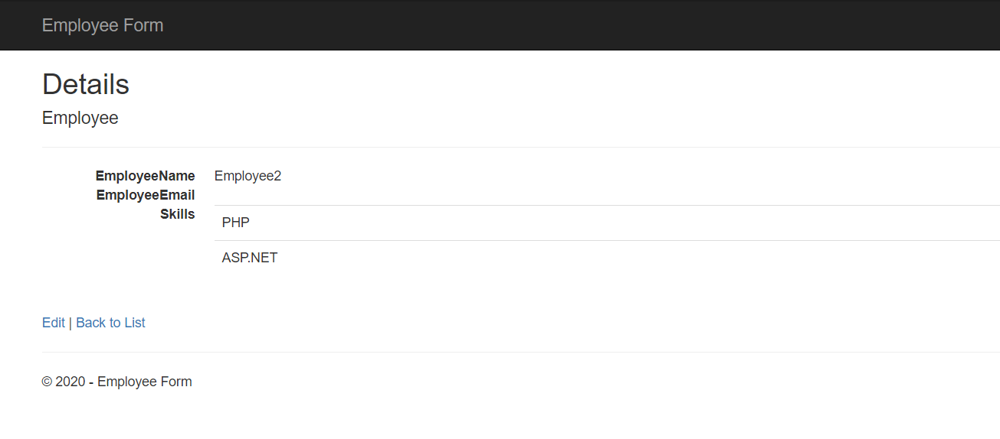

* When choosing Edit option for employee2, the form will be loaded with the employee data to be updated.

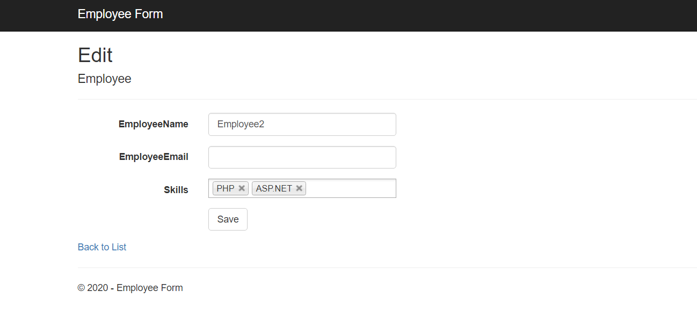

Do update

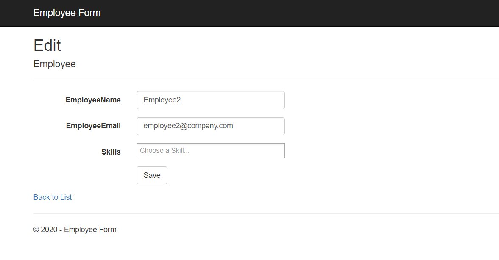

* Check Details page for employee2 after editting.

* When choosing Delete option for employee2, a confirmation message will occur.

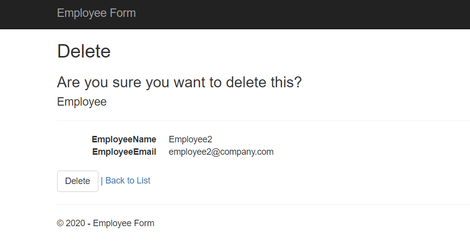

Employee table before Delete:

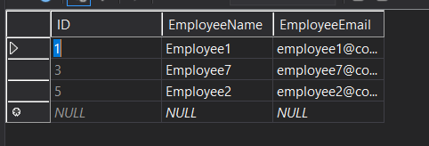

Employee table after Delete:

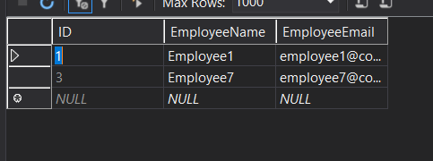

* Check Employee List after deleting employee2.

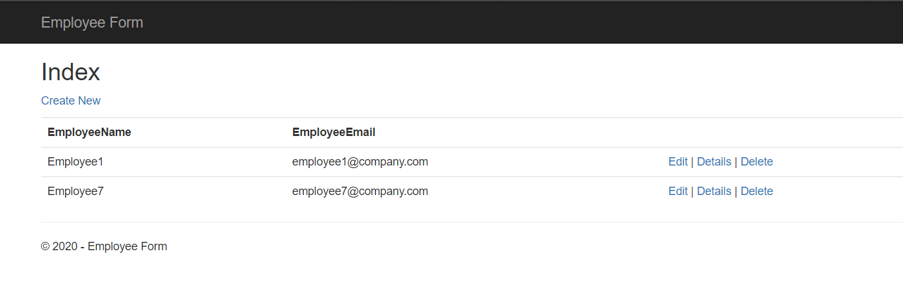
